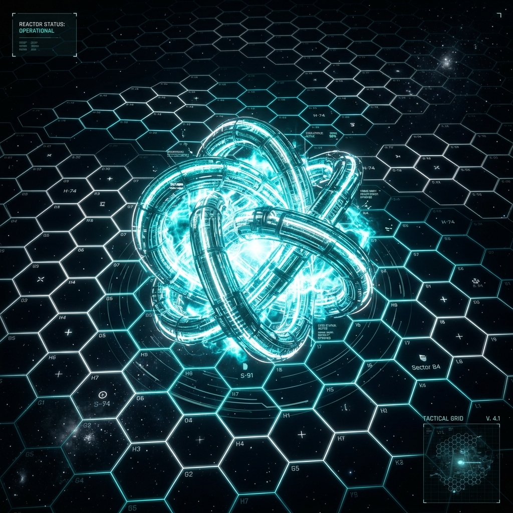
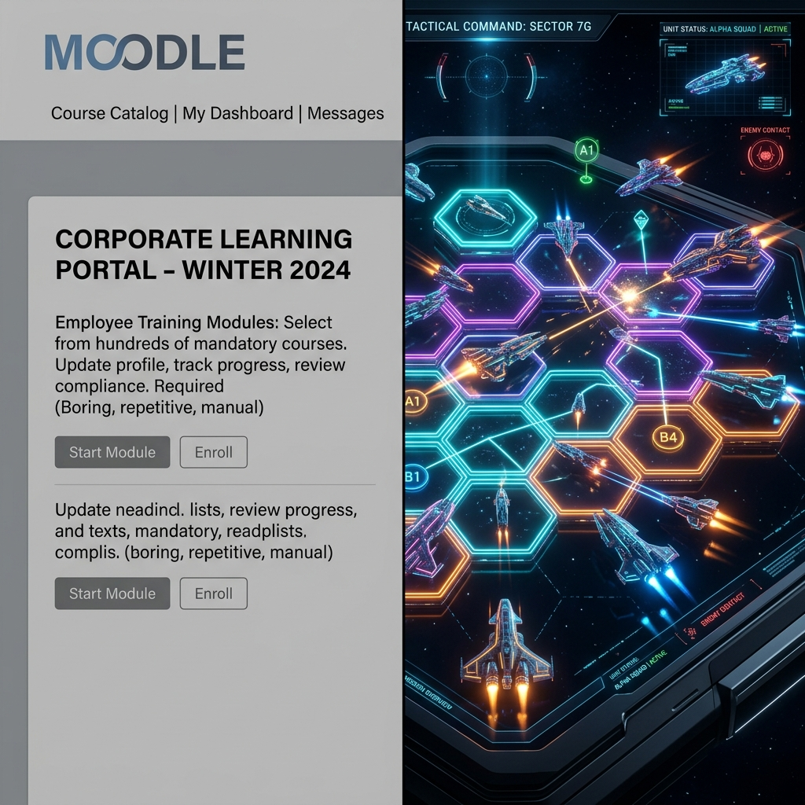
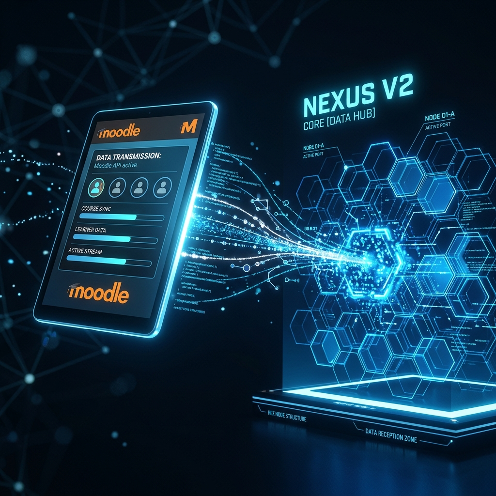
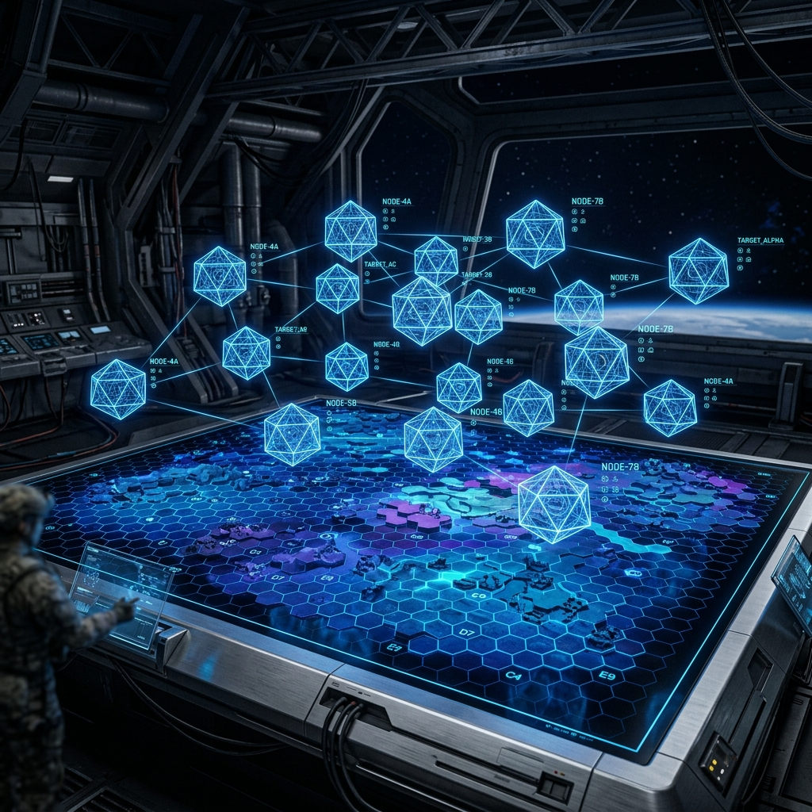
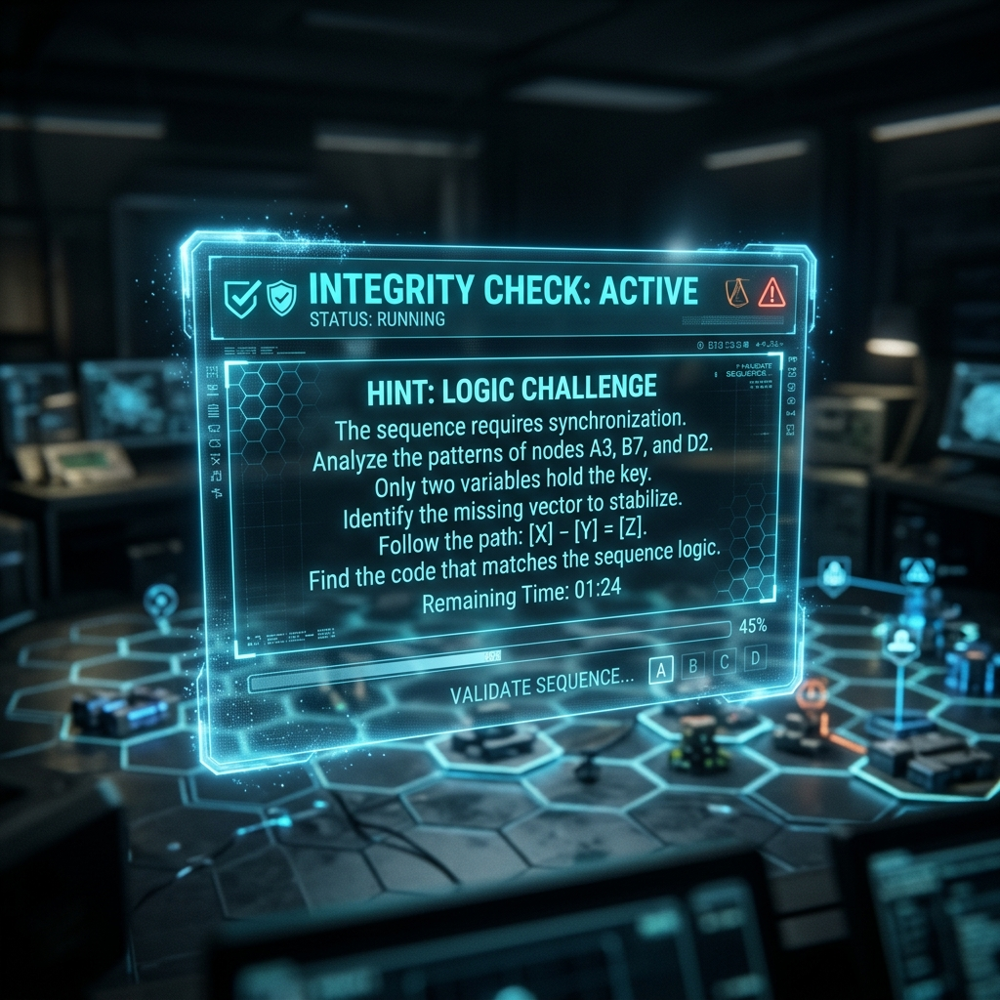
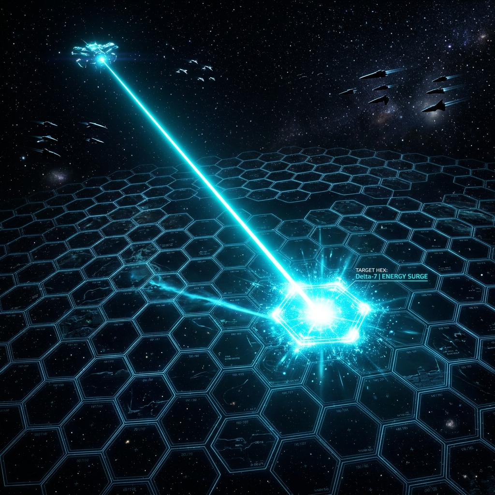
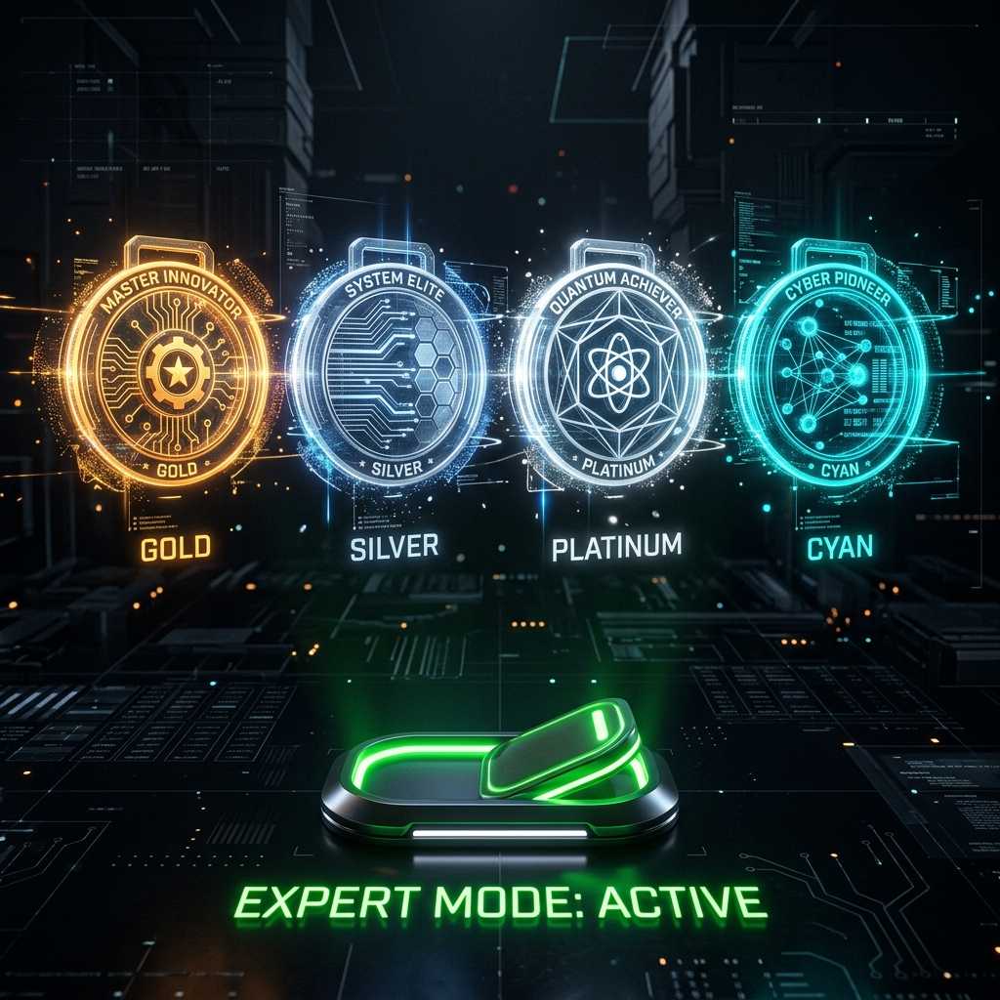
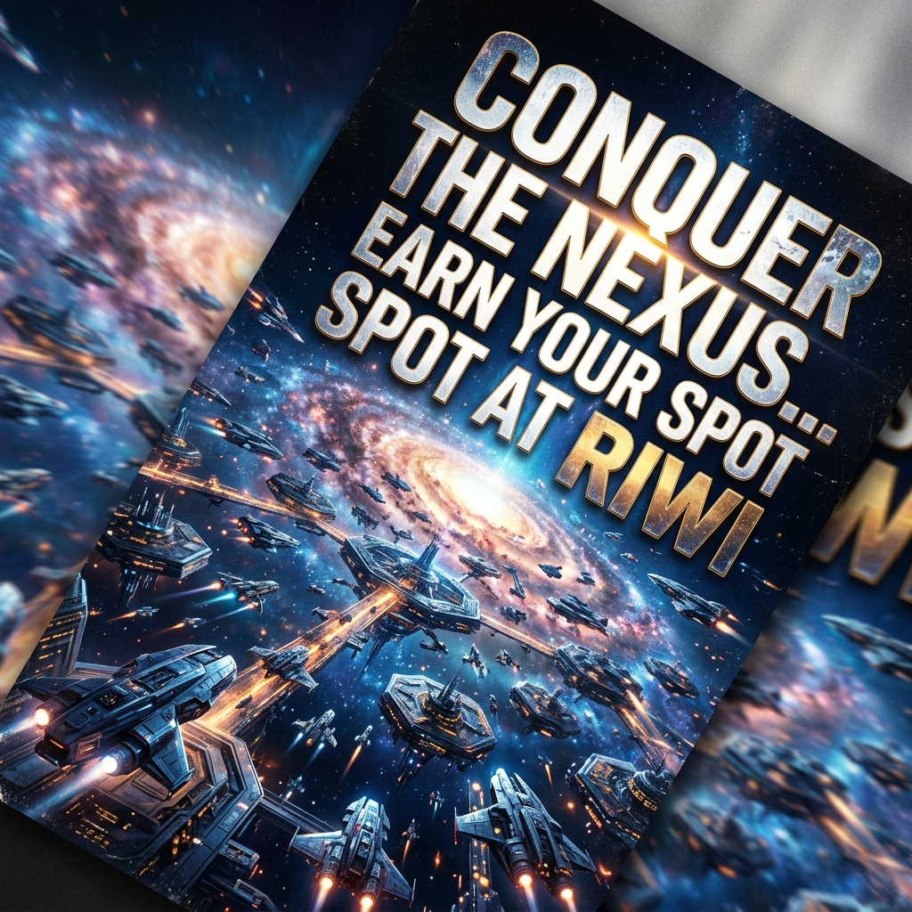
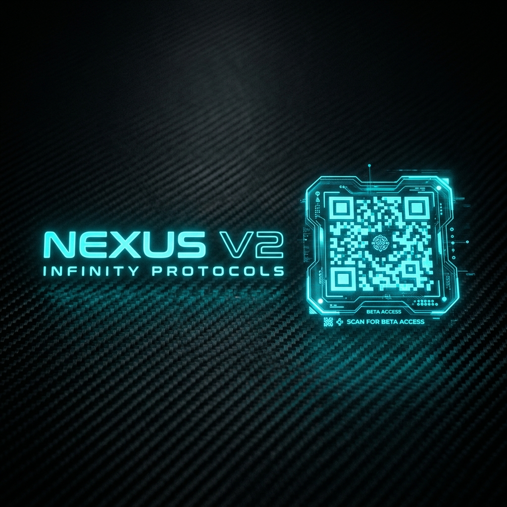

# 🌌 NEXUS V2: GUÍA MAESTRA DE PRESENTACIÓN (EDICIÓN FINAL)
**"Transformando el Aprendizaje en Conquista: El Ecosistema Nexus x Riwi"**

---

## INTRODUCCIÓN Y CONTEXTO [0:00 - 5:00]

### BLOQUE 1: Génesis y Visión Táctica (¿Qué es Nexus?)
*   **Guion**: "Nexus no es solo un juego; es el **Espejo Digital del Coder**. Nació de la necesidad de dar un propósito táctico al esfuerzo diario en Riwi. Nexus V2 es el motor que hace que los datos de Moodle cobren vida, transformando la educación pasiva en una **Inmersión Técnica de Grado Industrial**."
*   **[VISUALES]**:
    ````carousel
    
    <!-- slide -->
    
    ````

### BLOQUE 2: El Muro del Aburrimiento (El Problema)
*   **Guion**: "El mayor enemigo de Riwi no es la dificultad del código, es el aburrimiento. Un estudiante que ve su progreso solo como un número en Moodle corre riesgo de deserción. Nexus destruye esa barrera convirtiendo el currículo en una misión de conquista donde cada aprendizaje suma territorio."
*   **Visual**: 

---

## OPERACIÓN TÉCNICA Y PEDAGOGÍA [5:00 - 10:00]

### BLOQUE 3: Cerebro de Datos (Moodle Sync & Neural Sync)
*   **Guion**: "Nuestra innovación es el **Puente de Datos**. Nexus lee Moodle y detecta debilidades en Inglés o Soft Skills. El juego reacciona lanzando 'Misiones de Rescate' personalizadas. Aquí, repasar no es aburrido, es necesario para sincronizar los nodos lógicos del nexo."
*   **[VISUALES]**:
    ````carousel
    
    <!-- slide -->
    
    ````

### BLOQUE 4: Integridad y Pedagogía del Error (Anti-Fraude)
*   **Guion**: "Protegemos la honestidad técnica. Si el sistema detecta intento de fraude con IA o cambio de pestañas, el nexo se bloquea. En lugar de dar la respuesta, Nexus otorga **Tips Inteligentes**, forzando al estudiante a pensar y aprender de su propio error."
*   **Visual**: 

---

## MOTIVACIÓN Y VALOR ESTRATÉGICO [10:00 - 15:00]

### BLOQUE 5: Guerra Semanal y Dopamina (El Ranking)
*   **Guion**: "La dopamina se mantiene viva con el **Reinicio Semanal**. Cada lunes es una nueva oportunidad. Los clanes compiten ferozmente y el ganador de la semana aparece coronado en la cima del Nexo. Este 15-20% de impacto en la nota real garantiza una participación del 100% de la sede."
*   **[VISUALES]**:
    ````carousel
    
    <!-- slide -->
    
    ````

### BLOQUE 6: Maestría, Estatus y Dashboard Admin
*   **Guion**: "Nexus premia la disciplina. Asistencia perfecta y buen comportamiento socio-emocional desbloquean estatus de **Master** y naves premium. Para Riwi, esto se traduce en un **Dashboard de Talento** donde los directivos ven fallas académicas en tiempo real mediante mapas de calor."
*   **[VISUALES]**:
    ````carousel
    
    <!-- slide -->
    
    ````

---

## FUTURO Y CIERRE [15:00 - 20:00]

### BLOQUE 7: La Arena Global y Marketing Viral
*   **Guion**: "Nuestra visión es global. Al abrir torneos donde los 5 mejores del mundo ganan una beca en Riwi, convertimos a Nexus en la herramienta de marketing más potente del sector. El mundo querrá ser parte de Riwi para conquistar este mapa."
*   **Visual**: 

### BLOQUE 8: El Coder de Élite y Despliegue
*   **Guion**: "Al final, Riwi no entrega solo un diploma; entrega un **Perfil de Coder de Élite** validado por miles de horas de combate técnico. Estamos listos para el despliegue de la Fase Beta. Muchas gracias por su atención."
*   **[VISUALES]**:
    ````carousel
    
    <!-- slide -->
    
    ````
